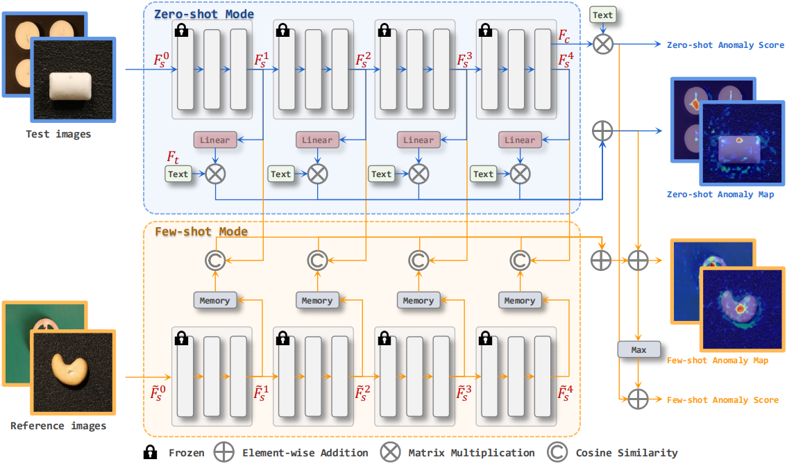

[Workshop Link](https://sites.google.com/view/vand-cvpr23/home) | [Challenge Link](https://sites.google.com/view/vand-cvpr23/challenge?authuser=0) | [Report Paper](https://arxiv.org/abs/2305.17382)
---
[Xuhai Chen](https://scholar.google.com.hk/citations?user=LU4etJ0AAAAJ&hl=zh-CN&authuser=1) · [Yue Han](https://scholar.google.com/citations?hl=en&user=08E500gAAAAJ&view_op=list_works&gmla=AHoSzlVzTXnclaPp9h1g8xAZQBrsxdFXvhunMA3AmRm_GSLnZA1956xavx6hmPaCFCysonsXeTQyhB_cokdUFacUc5HBunMPW-uOtLZLTTufiZiHB6hAVgr9l7cJ_UHKeQ) · [Jiangning Zhang](https://zhangzjn.github.io/)

This repository contains the official PyTorch implementation of [Zero-/Few-shot Anomaly Classification and Segmentation Method](https://arxiv.org/abs/2305.17382) used in the [CVPR 2023 VAND Challenge](https://sites.google.com/view/vand-cvpr23/challenge?authuser=0), which can be viewd as an improved version of [WinCLIP](https://arxiv.org/abs/2303.14814). We achieve **Winner** in the Zero-shot Track and **Honorable Mentions** in the Few-shot Track.



**Results on the Challenge official test set**


## Installation

- Prepare experimental environments

  ```shell
  pip install -r requirements.txt
  ```
  
## Dataset Preparation 
### MVTec AD
- Download and extract [MVTec AD](https://www.mvtec.com/company/research/datasets/mvtec-ad) into `data/mvtec`
- run`python data/mvtec.py` to obtain `data/mvtec/meta.json`
```
data
├── mvtec
    ├── meta.json
    ├── bottle
        ├── train
            ├── good
                ├── 000.png
        ├── test
            ├── good
                ├── 000.png
            ├── anomaly1
                ├── 000.png
        ├── ground_truth
            ├── anomaly1
                ├── 000.png
```

### VisA
- Download and extract [VisA](https://amazon-visual-anomaly.s3.us-west-2.amazonaws.com/VisA_20220922.tar) into `data/visa`
- run`python data/visa.py` to obtain `data/visa/meta.json`
```
data
├── visa
    ├── meta.json
    ├── candle
        ├── Data
            ├── Images
                ├── Anomaly
                    ├── 000.JPG
                ├── Normal
                    ├── 0000.JPG
            ├── Masks
                ├── Anomaly
                    ├── 000.png
```

## Train
Set parameters in `train.sh`.
- `train_data_path`: the path to the training dataset
- `dataset`: name of the training dataset, optional: mvtec, visa
- `model`: the CLIP model
- `pretrained`: the pretrained weights
- `features_list`: features to be mapped into the joint embedding space
- `image_size`: the size of the images inputted into the CLIP model
- `aug_rate`: the probability of stitching images (only for mvtec)

Then run the following command
  ```shell
  sh train.sh
  ```

## Test
### Pretrained Models
We provide our pre-trained models in `exps/pretrained`, where `mvtec_pretrained.pth` represents the model trained on the MVTec AD dataset and `visa_pretrained.pth` represents the model trained on the VisA dataset.

Set parameters in `test_zero_shot.sh`.
- `data_path`: the path to the test dataset
- `dataset`: name of the test dataset, optional: mvtec, visa
- `checkpoint_path`: the path to the test model

Then, run the following command to test them in the zero-shot setting:
  ```shell
  sh test_zero_shot.sh
  ```
  
Set parameters in `test_few_shot.sh`.
- `data_path`: the path to the test dataset
- `dataset`: name of the test dataset, optional: mvtec, visa
- `checkpoint_path`: the path to the test model
- `k_shot`: different number of reference images

Then, run the following command to test them in the few-shot setting:
  ```shell
  sh test_few_shot.sh
  ```

### Zero-shot Setting
Set parameters in `test_zero_shot.sh`.
- `data_path`: the path to the test dataset
- `dataset`: name of the test dataset, optional: mvtec, visa
- `checkpoint_path`: the path to the test model
- `model`: the CLIP model
- `pretrained`: the pretrained weights
- `features_list`: features to be mapped into the joint embedding space
- `image_size`: the size of the images inputted into the CLIP model
- `mode`: zero shot or few shot

Then run the following command
  ```shell
  sh test_zero_shot.sh
  ```

### Few-shot Setting
Set parameters in `test_few_shot.sh`.
- `data_path`: the path to the test dataset
- `dataset`: name of the test dataset, optional: mvtec, visa
- `checkpoint_path`: the path to the test model
- `model`: the CLIP model
- `pretrained`: the pretrained weights
- `features_list`: features to be mapped into the joint embedding space
- `few_shot_features`: features stored in the memory banks
- `image_size`: the size of the images inputted into the CLIP model
- `mode`: zero shot or few shot
- `k_shot`: different number of reference images
- `seed`: the random seed

Then run the following command
  ```shell
  sh test_few_shot.sh
  ```

## Citation
If our work is helpful for your research, please consider citing:

```
@article{chen2023zero,
  title={A Zero-/Few-Shot Anomaly Classification and Segmentation Method for CVPR 2023 VAND Workshop Challenge Tracks 1\&2: 1st Place on Zero-shot AD and 4th Place on Few-shot AD},
  author={Chen, Xuhai and Han, Yue and Zhang, Jiangning},
  journal={arXiv preprint arXiv:2305.17382},
  year={2023}
}
```

## Acknowledgements
We thank [WinCLIP: Zero-/Few-Shot Anomaly Classification and Segmentation](https://arxiv.org/abs/2303.14814) for providing assistance for our research.

